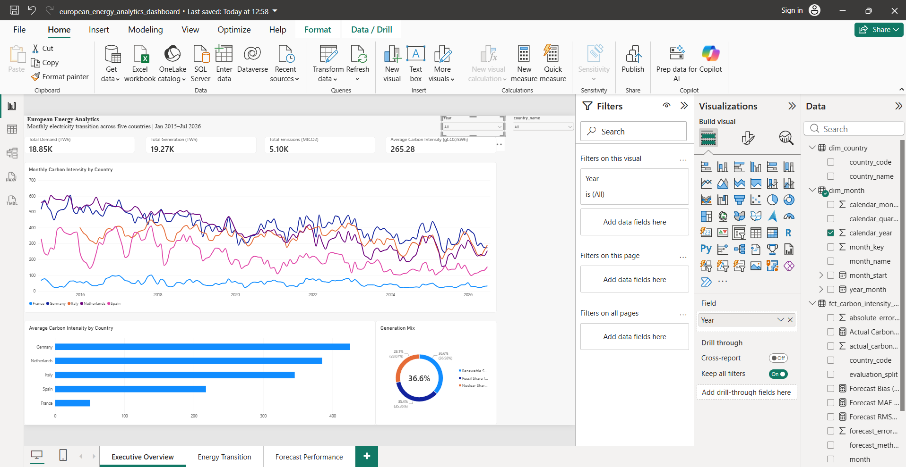
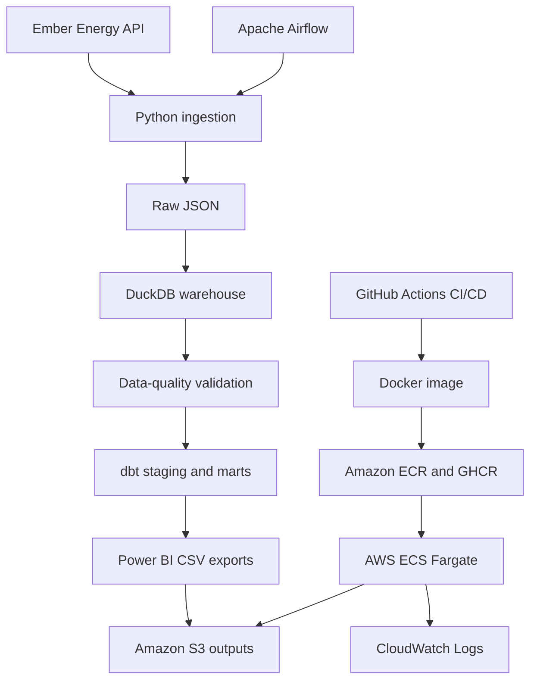

# European Energy Analytics Pipeline

[](https://github.com/FizaNaeem2/european-energy-analytics-pipeline/actions/workflows/ci.yml)
[](https://github.com/FizaNaeem2/european-energy-analytics-pipeline/actions/workflows/cd.yml)

An end-to-end data engineering and analytics pipeline for comparing electricity generation, demand, power-sector emissions, carbon intensity, and renewable-energy trends across five European countries.

The project ingests monthly data from the Ember Energy API, validates and loads it into DuckDB, transforms it with dbt, prepares analytical outputs for Power BI, packages the workflow with Docker and Airflow, and demonstrates a production-style deployment on AWS ECS Fargate.

## Power BI dashboard



The interactive Power BI report contains three pages: **Executive Overview**, **Energy Transition**, and **Forecast Performance**. It combines country and year filters with demand, generation, emissions, carbon-intensity, generation-mix, and forecast-quality views.

## Countries and coverage

- Italy (`ITA`)
- Germany (`DEU`)
- France (`FRA`)
- Spain (`ESP`)
- Netherlands (`NLD`)
- Monthly data from January 2015 through the latest month available from Ember

## Architecture



## What the pipeline does

1. Extracts four Ember datasets for all five countries.
2. Preserves the API responses as raw JSON.
3. Loads the raw datasets into DuckDB tables.
4. Checks required countries, duplicate grains, nulls, ranges, and monthly coverage.
5. Runs dbt staging, intermediate, mart, and forecast models.
6. Executes schema and custom business-rule tests.
7. Exports four analytics-ready CSV tables for Power BI.
8. Optionally uploads generated files to encrypted, run-specific and `latest` S3 paths.

## Technology stack

| Area | Tools |
|---|---|
| Ingestion | Python, Requests, Ember Energy API |
| Storage | JSON, DuckDB, Amazon S3 |
| Transformation | dbt-duckdb, SQL |
| Data quality | Python validation, dbt schema tests, custom SQL tests |
| Orchestration | Apache Airflow |
| Analytics | pandas, Power BI-ready CSV exports |
| Containers | Docker, Docker Compose |
| CI/CD | GitHub Actions, GitHub OIDC |
| AWS | ECR, ECS Fargate, IAM, Systems Manager Parameter Store, CloudWatch Logs, S3 |

## Repository structure

```text
.
├── .github/workflows/        # CI and container publishing
├── config/dbt/               # dbt profile
├── dags/                     # Airflow DAG
├── energy_analytics/         # dbt project, models, and tests
├── infra/                    # Validated ECS task definition
├── notebooks/                # Exploratory analysis
├── power_bi/                 # Power BI project assets
├── src/                      # Ingestion, loading, validation, export, S3 upload
├── Dockerfile
├── docker-compose.yaml
├── requirements.txt
└── requirements-airflow.txt
```

## Local execution

### Prerequisites

- Python 3.13
- An Ember Energy API key
- Docker Desktop for the containerized Airflow environment

### Setup

```bash
python -m venv .venv
source .venv/bin/activate
pip install -r requirements.txt
```

On Windows PowerShell, activate the environment with:

```powershell
.\.venv\Scripts\Activate.ps1
```

Create a local `.env` file. Never commit the real key:

```dotenv
EMBER_API_KEY=replace_with_your_key
```

### Run the pipeline

```bash
python -u src/ingest_ember.py
python -u src/load_duckdb.py
python -u src/validate_data.py
dbt build --project-dir energy_analytics --profiles-dir config/dbt
python -u src/export_power_bi.py
```

To upload outputs to S3, configure authenticated AWS credentials and set `S3_BUCKET`, `AWS_REGION`, and `S3_PREFIX` before running:

```bash
python -u src/upload_to_s3.py
```

## Airflow

The DAG [`european_energy_analytics_pipeline`](dags/energy_analytics_pipeline.py) models the pipeline as six ordered tasks:

```text
ingest → load → validate → dbt build → Power BI export → optional S3 upload
```

Start the local containerized Airflow environment with:

```bash
docker compose up --build
```

The S3 task safely skips itself when `S3_BUCKET` is not configured.

## Data model

The dbt project follows a layered warehouse design:

- **Staging:** cleans and standardizes each raw Ember dataset.
- **Intermediate:** combines generation, demand, emissions, and carbon-intensity measures at defined grains.
- **Marts:** produces country and month dimensions, a country-month energy fact table, and a carbon-intensity forecast table.
- **Tests:** validates uniqueness, non-null fields, accepted values, grain integrity, and analytical business rules.

Power BI receives:

- `dim_country.csv`
- `dim_month.csv`
- `fct_country_monthly_energy.csv`
- `fct_carbon_intensity_forecast.csv`

## CI/CD

### Continuous integration

[`.github/workflows/ci.yml`](.github/workflows/ci.yml) runs on pushes and pull requests to `main`. It:

- installs pinned Python dependencies;
- checks Python syntax;
- validates Docker Compose;
- builds the Airflow image;
- verifies the Airflow DAG imports without errors;
- runs ingestion, DuckDB loading, data validation, dbt build/tests, and the Power BI export.

### Container publishing

The active [`.github/workflows/cd.yml`](.github/workflows/cd.yml) is deliberately manual-only. When explicitly started, it:

- builds the self-contained Airflow image;
- publishes `latest` and commit-SHA tags to GHCR using the repository's `GITHUB_TOKEN`;
- performs no automatic registry writes after ordinary commits.

For the completed AWS deployment checkpoint, an earlier revision of this workflow used GitHub OIDC to obtain short-lived AWS credentials and publish the same image to Amazon ECR without storing permanent AWS access keys.

## AWS ECS Fargate deployment

The validated task definition is stored in [`infra/ecs-task-definition.json`](infra/ecs-task-definition.json) and was added in commit [`82c1af6`](https://github.com/FizaNaeem2/european-energy-analytics-pipeline/commit/82c1af63a0b1d66af4a31347218e2ac58a0453f5).

Deployment design:

- **Region:** Europe (Frankfurt), `eu-central-1`
- **Runtime:** AWS ECS Fargate, Linux/X86_64
- **Task size:** 1 vCPU and 3 GiB memory
- **Secrets:** Ember API key injected from Systems Manager Parameter Store
- **Permissions:** separate least-privilege task and task-execution IAM roles
- **Image:** private Amazon ECR image produced by GitHub Actions
- **Logs:** CloudWatch Logs with seven-day retention during validation
- **Outputs:** S3 with AES-256 server-side encryption and both immutable run paths and a convenient `latest` path

### Deployment validation evidence

A manual Fargate execution of `energy-analytics-pipeline:1` completed successfully:

| Check | Verified result |
|---|---|
| Container outcome | Exit code `0` |
| Ingestion | Four monthly Ember datasets processed for five countries |
| Warehouse | DuckDB raw tables created and validated |
| Transformations | dbt models built successfully |
| Tests | All dbt tests passed |
| Analytics export | Power BI-ready tables generated |
| S3 delivery | Nine pipeline files uploaded |
| S3 organization | Files written to run-specific and `latest` paths |
| Observability | Full execution logs captured in CloudWatch |

The successful manual run proves the deployment while avoiding an always-on service.

## Cost-control decision

Automatic AWS scheduling is intentionally disabled. No ECS service or EventBridge schedule is required for this portfolio demonstration, and the Fargate task runs only when started manually.

After the successful AWS validation, ECR publishing was removed and the remaining GHCR workflow was made manual-only, so future commits do not automatically publish container images. Chargeable demonstration storage can now be removed from ECR, S3, and CloudWatch while the reusable source code, task definition, CI/CD workflow, and verified deployment results remain documented in GitHub.

## Security

- The Ember API key is never stored in the repository or task definition.
- Local secrets are loaded from `.env`.
- ECS retrieves the production secret from Parameter Store.
- The validated AWS deployment used GitHub OIDC rather than permanent AWS access keys.
- Task and execution permissions use separate IAM roles.
- S3 uploads request server-side encryption.
- Generated datasets, databases, and local secret files are excluded from Git.

## Project status

**Complete portfolio implementation.**

The pipeline has been tested locally, validated by GitHub Actions, packaged as a self-contained Airflow image, published to GHCR, and successfully executed through an OIDC-authenticated Amazon ECR/ECS Fargate deployment with verified S3 outputs. Recurring AWS scheduling was deliberately excluded, ECR publishing was removed, and GHCR publishing is manual-only to prevent unnecessary ongoing cloud usage.
