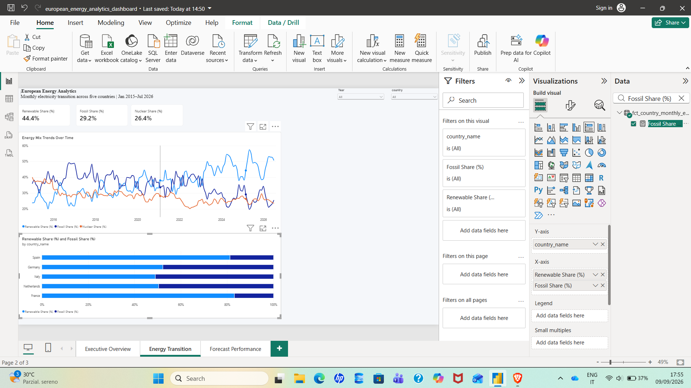
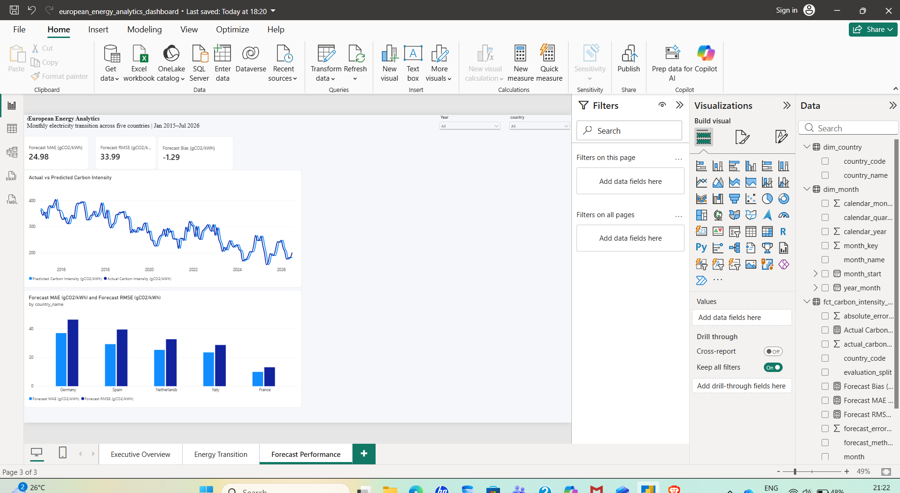
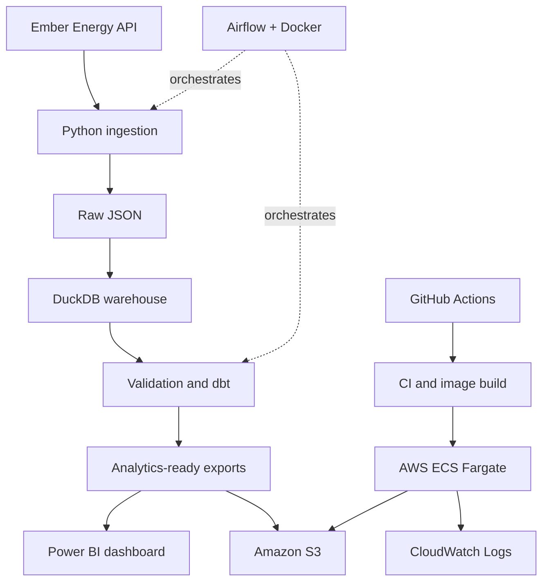

# European Energy Analytics Pipeline

[](https://github.com/FizaNaeem2/european-energy-analytics-pipeline/actions/workflows/ci.yml)
[](https://github.com/FizaNaeem2/european-energy-analytics-pipeline/actions/workflows/cd.yml)

**A production-style data engineering and analytics project that turns monthly Ember electricity data into tested warehouse models, a three-page Power BI report, and cloud-ready analytical outputs.**

The pipeline compares electricity demand, generation mix, renewable adoption, power-sector emissions, carbon intensity, and forecast performance across **France, Germany, Italy, the Netherlands, and Spain**.

## Project at a glance

| Area | Result |
|---|---|
| Data scope | Four monthly Ember datasets, five countries, January 2015 to the latest available month |
| Engineering | Python ingestion, raw JSON preservation, DuckDB warehouse, and layered dbt models |
| Data quality | Source validation plus **101 passing dbt tests** |
| Analytics | Country-level energy-transition analysis and carbon-intensity forecasting |
| BI | Complete three-page Power BI report with interactive country and year filters |
| Orchestration | Six-stage Apache Airflow DAG packaged with Docker |
| CI/CD | Full pipeline and container validation in GitHub Actions; manual GHCR publishing |
| Cloud proof | Successful AWS ECS Fargate run, exit code **0**, with **nine files delivered to S3** |

## Power BI dashboard

The report is available as a committed [Power BI project file](power_bi/european_energy_analytics_dashboard.pbix). Its three pages move from high-level KPIs to energy-transition trends and forecast evaluation.

### Executive Overview

Demand, generation, emissions, average carbon intensity, country trends, and generation mix.

[](docs/images/power-bi-dashboard.png)

| Energy Transition | Forecast Performance |
|:---:|:---:|
| Renewable, fossil, and nuclear shares by country and over time | Actual versus predicted carbon intensity with MAE and RMSE comparisons |
| [](docs/images/power-bi-energy-transition.png) | [](docs/images/power-bi-forecast-performance.png) |

_Click any dashboard image to open the full-size view._

## Architecture



## How the pipeline works

| Stage | Implementation | Purpose |
|---|---|---|
| 1. Extract | [`src/ingest_ember.py`](src/ingest_ember.py) | Requests four Ember monthly datasets for all five countries and preserves raw responses |
| 2. Load | [`src/load_duckdb.py`](src/load_duckdb.py) | Normalizes the JSON payloads into DuckDB source tables |
| 3. Validate | [`src/validate_data.py`](src/validate_data.py) | Checks country coverage, duplicate grains, missing values, valid ranges, and monthly continuity |
| 4. Transform | [`energy_analytics/`](energy_analytics/) | Builds staging, intermediate, mart, and forecast models with dbt-duckdb |
| 5. Export | [`src/export_power_bi.py`](src/export_power_bi.py) | Produces four analytics-ready CSV tables for Power BI |
| 6. Deliver | [`src/upload_to_s3.py`](src/upload_to_s3.py) | Optionally uploads outputs to encrypted run-specific and `latest` S3 paths |

The ordered workflow is implemented in [`dags/energy_analytics_pipeline.py`](dags/energy_analytics_pipeline.py):

```text
ingest → load → validate → dbt build → Power BI export → optional S3 upload
```

## Data model and analytics

The dbt project separates transformation logic into three layers:

- **Staging** standardizes the four Ember source datasets.
- **Intermediate** joins demand, generation, emissions, and carbon-intensity measures at consistent grains.
- **Marts** exposes country and month dimensions, a country-month energy fact table, and a carbon-intensity forecast table.

Power BI consumes:

- `dim_country.csv`
- `dim_month.csv`
- `fct_country_monthly_energy.csv`
- `fct_carbon_intensity_forecast.csv`

The forecasting analysis uses a country-level persistence baseline and evaluates predictions with error, bias, MAE, and RMSE measures. Quality controls combine Python validation, dbt schema tests, and custom business-rule tests.

## Verified AWS deployment

A manual run of ECS task definition `energy-analytics-pipeline:1` validated that the containerized workflow operates outside the local development environment.

| Verification | Observed result |
|---|---|
| Runtime | AWS ECS Fargate, Linux/X86_64, 1 vCPU, 3 GiB |
| Container result | **Exit code 0** |
| Data pipeline | Ingestion, DuckDB loading, validation, dbt build, and export completed |
| Tests | **101 dbt tests passed** |
| Delivery | **Nine pipeline files uploaded to Amazon S3** |
| Storage layout | Immutable run-specific paths plus a convenient `latest` path |
| Observability | Complete task output captured in CloudWatch Logs |
| Secret handling | Ember API key injected from AWS Systems Manager Parameter Store |

The validated task definition is versioned at [`infra/ecs-task-definition.json`](infra/ecs-task-definition.json) and was introduced in commit [`82c1af6`](https://github.com/FizaNaeem2/european-energy-analytics-pipeline/commit/82c1af63a0b1d66af4a31347218e2ac58a0453f5).

## CI/CD

### Continuous integration

[`.github/workflows/ci.yml`](.github/workflows/ci.yml) runs on pushes and pull requests to `main`. It:

- installs pinned Python dependencies;
- checks Python syntax and Docker Compose configuration;
- builds the Airflow image and validates the DAG import;
- runs ingestion, loading, raw-data validation, dbt build/tests, and Power BI export.

### Container publishing

[`.github/workflows/cd.yml`](.github/workflows/cd.yml) is deliberately **manual-only**. When started, it publishes `latest` and commit-SHA image tags to GitHub Container Registry. The completed AWS validation used GitHub OIDC and a private ECR image without storing permanent AWS access keys.

## Run locally

### Prerequisites

- Python 3.13
- An Ember Energy API key
- Docker Desktop, only if using the containerized Airflow environment

### Python setup

```bash
python -m venv .venv
source .venv/bin/activate
pip install -r requirements.txt
```

On Windows PowerShell:

```powershell
.\.venv\Scripts\Activate.ps1
pip install -r requirements.txt
```

Create a local `.env` file:

```dotenv
EMBER_API_KEY=replace_with_your_key
```

Run the complete analytical pipeline:

```bash
python -u src/ingest_ember.py
python -u src/load_duckdb.py
python -u src/validate_data.py
dbt build --project-dir energy_analytics --profiles-dir config/dbt
python -u src/export_power_bi.py
```

Or start the containerized Airflow environment:

```bash
docker compose up --build
```

The S3 delivery stage safely skips when `S3_BUCKET` is not configured.

## Repository guide

| Path | Contents |
|---|---|
| [`src/`](src/) | Ingestion, loading, validation, export, and S3 delivery scripts |
| [`energy_analytics/`](energy_analytics/) | dbt models, tests, macros, and project configuration |
| [`dags/`](dags/) | Airflow orchestration |
| [`notebooks/`](notebooks/) | Exploratory analysis and forecasting work |
| [`power_bi/`](power_bi/) | Power BI report file |
| [`infra/`](infra/) | Reusable ECS Fargate task definition |
| [`.github/workflows/`](.github/workflows/) | CI and manual container publishing |
| [`docs/images/`](docs/images/) | Dashboard evidence used in this README |

## Security and cost controls

- Secrets are excluded from Git and loaded from `.env` locally or Parameter Store on ECS.
- Task and task-execution permissions use separate IAM roles.
- S3 uploads request AES-256 server-side encryption.
- GitHub OIDC was used for the validated AWS deployment instead of permanent access keys.
- No ECS service or EventBridge schedule is active; the cloud run was a manual portfolio validation.
- Container publishing is manual-only, preventing registry writes after ordinary commits.

## Status

**Complete portfolio implementation.** The pipeline has been validated locally, in GitHub Actions, and through a successful AWS ECS Fargate execution with tested transformations, CloudWatch evidence, and verified S3 outputs.
